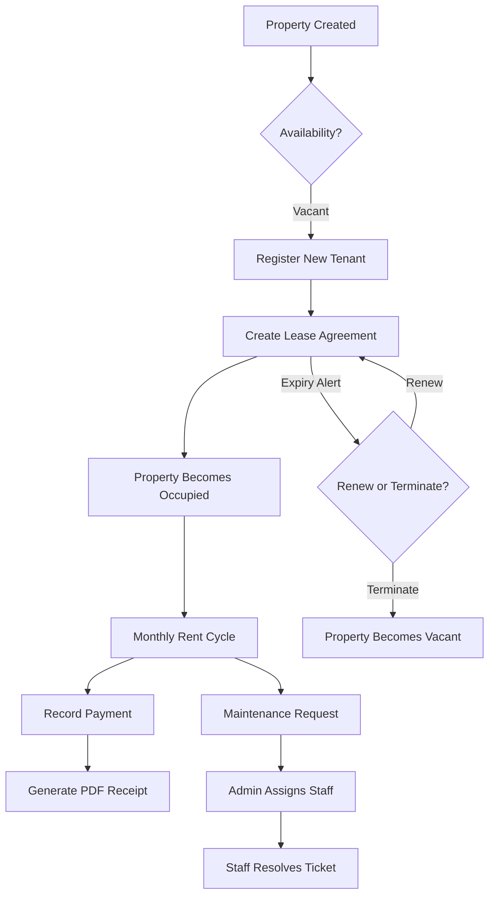

# 🏠 SmartRentals — Advanced Rental Management System

[](https://www.python.org/)
[](https://flask.palletsprojects.com/)
[](https://firebase.google.com/)
[](https://opensource.org/licenses/MIT)

> **Digitizing the rental experience.** A comprehensive, browser-based ecosystem for property owners, tenants, and maintenance staff to manage the entire rental lifecycle seamlessly.

---

## 📖 Overview

**SmartRentals** was born out of a simple problem: property management is often a chaotic mess of WhatsApp messages, Excel sheets, and handwritten receipts. 

This platform centralizes everything. From property listing and tenant onboarding to automated rent tracking and maintenance management, SmartRentals provides a unified, glassmorphic interface that feels premium and functions powerfully.

---

## 🚀 Core Features

### 🏢 Multi-User Portals
- **Admin Dashboard**: Full control over properties, tenants, agreements, and staff assignments.
- **Tenant Portal**: Self-service access to lease details, payment history, and one-click maintenance requests.
- **Staff Portal**: Simplified interface for maintenance crews to track and resolve assigned tasks.

### 📋 Management Modules
- **Property Tracking**: Manage multiple units with automated availability status (Vacant/Occupied).
- **Tenant CRM**: Securely store tenant profiles, ID proofs, and emergency contacts.
- **Dynamic Lease Agreements**: Digital agreements with custom rent due days, late fee logic, and automated expiry alerts (🔴 ≤ 7 days, 🟡 ≤ 30 days).
- **Automated Billing**: Record payments via UPI/Cash/Bank, calculate late fees, and generate professional **PDF receipts**.
- **Maintenance Lifecycle**: Status tracking from *Open* to *Resolved* with photo descriptions and staff assignments.

---

## 🛠️ Use Cases

### 👨‍💼 Use Case 1: The Property Manager (Admin)
*   **Goal**: Ensure 100% occupancy and on-time payments.
*   **Activity**: Admin checks the dashboard for "Agreement Expiry Alerts" (Phase 4). They notice a tenant's lease ends in 15 days. They contact the tenant, renew the agreement in one click, and the dashboard stat updates automatically.

### 👤 Use Case 2: The Modern Tenant
*   **Goal**: Quick access to receipts and maintenance.
*   **Activity**: A tenant notices a leaking faucet. They log in to their portal, raise a "Plumbing" complaint with a description. They can check back anytime to see if a staff member has been assigned.

### 🔧 Use Case 3: The Maintenance Staff
*   **Goal**: Efficiently handle repairs.
*   **Activity**: The plumber logs into their dedicated portal, sees only the "Open" plumbing tickets assigned to them, updates the status to "In Progress," and finally "Resolved" once the work is done.

---

## 🔄 System Workflow

The following diagram illustrates the standard lifecycle of a rental unit within SmartRentals:



---

## 🎨 Design Philosophy: "Premium Utility"

SmartRentals isn't just a tool; it's an experience.
- **Glassmorphism**: Modern UI using translucent containers, blur effects, and vibrant gradients.
- **Color Rule (60-30-10)**: 
    - **60% Primary**: Deep Earthy Tones / Dark Mode.
    - **30% Secondary**: Soft Glass Finishes.
    - **10% Accent**: Bright Blaze Orange (`#FF5F38`) for calls to action.
- **Responsive**: Built for desktop management and mobile-ready tenant access.

---

## 💻 Tech Stack

- **Backend**: Python 3.9+ with **Flask**
- **Database**: **Firebase Firestore** (NoSQL, Real-time)
- **Security**: CSRF Protection, Session Management, and Firebase Admin SDK
- **PDF Engine**: `fpdf2` for dynamic invoice generation
- **Frontend**: HTML5, Vanilla CSS, JS (Poppins Typography)

---

## 🔑 Login Credentials (Development)

To explore the tri-portal system, use the following default/setup credentials:

### 🔴 Admin Portal
*   **URL**: `http://localhost:5000/login`
*   **Username**: `admin`
*   **Password**: `admin123`
*   *Note: used for managing properties, tenants, and system-wide stats.*

### 👤 Tenant Portal
*   **URL**: `http://localhost:5000/tenant/login`
*   **Credentials**: A registered tenant's **Phone Number** and the **Portal Password** set by the Admin during registration.
*   *Step: Register a tenant in the Admin portal first.*

### 🔧 Staff Portal
*   **URL**: `http://localhost:5000/staff/login`
*   **Credentials**:
    *   **Username**: `john_p`
    *   **Password**: `staff123`
    *   *(Role: Plumber - Seeded as sample staff)*
*   *Note: You can add more staff members via Admin -> Staff Management.*

---

## ⚙️ Installation & Setup

1. **Clone the repository**:
   ```bash
   git clone https://github.com/Bharat82450-Dare/SmartRentals.git
   cd SmartRentals
   ```

2. **Install dependencies**:
   ```bash
   pip install -r requirements.txt
   ```

3. **Firebase Configuration**:
   Follow these steps to set up your database:
   *   Go to the [Firebase Console](https://console.firebase.google.com/) and create a new project.
   *   Navigate to **Build > Firestore Database** and click **Create Database**.
   *   Select **Start in test mode** for initial development.
   *   Go to **Project Settings (⚙️) > Service Accounts**.
   *   Click **Generate new private key** and download the JSON file.
   *   Rename the file to `serviceAccountKey.json` and place it in the root directory of this project.

4. **Initialize / Seed Database**:
   Run the following script to create sample properties and a staff account:
   ```bash
   python seed_database.py
   ```

5. **Run the application**:
   
   **Using Python (Locally):**
   ```bash
   python app.py
   ```
   
   **Using Docker (Recommended):**
   ```bash
   docker-compose up --build
   ```
   Access the dashboard at `http://127.0.0.1:5000` (or `http://localhost:5000`).

---

## 🤝 Team Collaboration Guide

To maintain a clean and stable codebase, all teammates (**Anshul** and **Kaushik**) must follow this workflow.

### 1. Initial Setup
Clone the repository and fetch all branches:
```bash
git clone https://github.com/Bharat82450-Dare/SmartRentals.git
cd SmartRentals
git fetch origin
```

### 2. Working on your Dedicated Branch
**DO NOT work directly on the `main` branch.** Switch to your assigned branch immediately after cloning:

*   **Anshul**: `git checkout anshul`
*   **Kaushik**: `git checkout kaushik`

### 3. Daily Workflow
Follow these steps every time you work on a feature:

1.  **Sync with Main**: Keep your branch up to date with the latest stable code.
    ```bash
    git checkout main
    git pull origin main
    git checkout [your-branch-name]
    git merge main
    ```
2.  **Make Changes**: Write your code, test it locally.
3.  **Commit**: Use descriptive commit messages.
    ```bash
    git add .
    git commit -m "feat: added late fee logic to payment module"
    ```
4.  **Push**: Push your changes to **your branch** on GitHub.
    ```bash
    git push origin [your-branch-name]
    ```

### 4. Merging Code (Pull Requests)
Once your feature is ready and tested on your branch:
1.  Go to the [GitHub Repository](https://github.com/Bharat82450-Dare/SmartRentals).
2.  Click on **Compare & pull request**.
3.  Assign **@Bharat82450-Dare** as a reviewer.
4.  Once reviewed and approved, the code will be merged into `main`.

> [!WARNING]
> Direct pushes to the `main` branch are restricted. Always use Pull Requests for merging.

---

## 📄 License
Distributed under the MIT License. See `LICENSE` for more information.

---
*Developed with ❤️ for Property Managers everywhere.*
